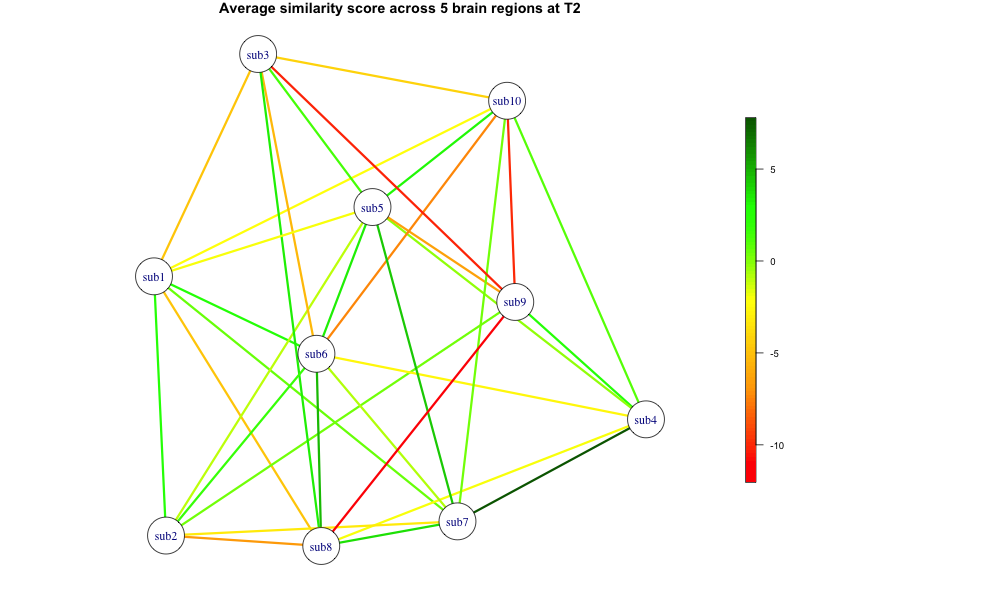
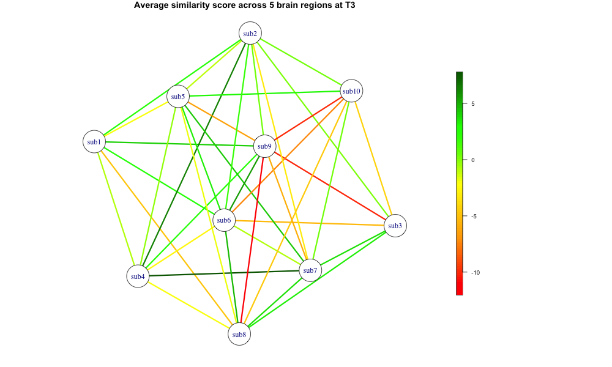
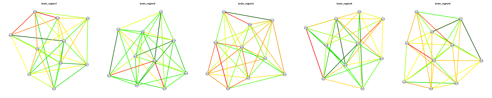
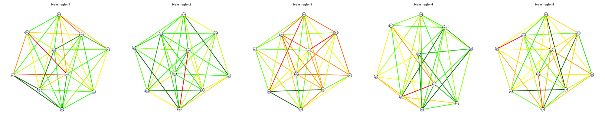

```{r setup, include=FALSE}
knitr::opts_chunk$set(echo = TRUE, include = TRUE)
library(igraph)
library(dplyr)
library(tidyr)
library(ggplot2)
library(readr)
library(stringr)
library(scales)
library(fields)
library(reticulate)
require("reticulate")
py_install("pandas", pip = TRUE)
pd <- import("pandas")
```


```{r data-ingestion, include=TRUE}
subject_ts <- read.csv("data/subject_ts.csv")

subject_demo_ratings <- read.csv("data/subject_demo_ratings.csv")

dyad <- read.csv("data/dyad_list.csv")

edgelist_t2 <- read.csv("data/edgelist_t2.csv")
edgelist_t3 <- read.csv("data/edgelist_t3.csv")

dist_colleges <- read.csv("data/demo_info/dist_colleges.csv")
dist_hometowns <- read.csv("data/demo_info/dist_hometowns.csv")

dict_major_cat <- as.data.frame(pd$read_pickle("data/demo_info/dict_major_cat.pkl"))
dict_major_cat <- data.frame(
  major = names(dict_major_cat), # using indexes to make variable major
  cat = as.factor(unlist(dict_major_cat)),
  row.names = NULL)
dict_major_cat <- dict_major_cat %>%
  mutate(major = gsub("\\.", " ", major))

dict_college_public_private <- pd$read_pickle("data/demo_info/dict_college_public_private.pkl")
dict_college_public_private <- data.frame(
  college = names(dict_college_public_private),
  cat = unlist(dict_college_public_private),
  row.names = NULL
)
dict_college_public_private <- dict_college_public_private %>%
  mutate(college = gsub("\\.", " ", college))

dict_hometown_population <- pd$read_pickle("data/demo_info/dict_hometown_population.pkl")
dict_hometown_population <- data.frame(
  city = names(dict_hometown_population),
  pop = unlist(dict_hometown_population),
  row.names = NULL)
dict_hometown_population <- dict_hometown_population %>%
  mutate(city = gsub("\\.", " ", city))

```

```{r creation-of-new-columns, include=TRUE}
dyad["age_dist"] <- ""
dyad["gender_similarity"] <- ""
dyad["nationality_similarity"] <- ""
dyad["hometown_population_similarity"] <- ""
dyad["dist_hometown"] <- ""
dyad["dist_college"] <- ""
dyad["college_pub_priv_similarity"] <- ""
dyad["major_similarity"] <- ""
dyad["industry_similarity"] <- ""
dyad["handedness_similarity"] <- ""
dyad["interest_similarity"] <- ""
dyad["enjoy_similarity"] <- ""
```

```{r creation-ratings}
enjoy_cols <- grep("enjoy", names(subject_demo_ratings), value = TRUE)
interest_cols = grep("interest", names(subject_demo_ratings), value = TRUE)

for (i in 1:nrow(dyad)) {
  dyad_subj1 <- dyad$dyad_subject1[i]
  dyad_subj2 <- dyad$dyad_subject2[i]
  
  dyad_subj1_age <- subject_demo_ratings$age[subject_demo_ratings$subject==dyad_subj1]
  dyad_subj2_age <- subject_demo_ratings$age[subject_demo_ratings$subject==dyad_subj2]
  age_dist <- abs(dyad_subj1_age-dyad_subj2_age)
  dyad$age_dist[i] <- age_dist
  
  dyad_subj1_gender <- subject_demo_ratings$gender[subject_demo_ratings$subject==dyad_subj1]
  dyad_subj2_gender <- subject_demo_ratings$gender[subject_demo_ratings$subject==dyad_subj2]
  gender_similarity <- as.numeric(dyad_subj2_gender==dyad_subj1_gender)
  dyad$gender_similarity[i] = gender_similarity
  
  dyad_subj1_nationality <- subject_demo_ratings$nationality[subject_demo_ratings$subject==dyad_subj1]
  dyad_subj2_nationality <- subject_demo_ratings$nationality[subject_demo_ratings$subject==dyad_subj2]
  nationality_similarity <- as.numeric(dyad_subj2_nationality==dyad_subj1_nationality)
  dyad$nationality_similarity[i] = nationality_similarity
  
  dyad_subj1_hometown <- subject_demo_ratings$hometown[subject_demo_ratings$subject==dyad_subj1]
  dyad_subj2_hometown <- subject_demo_ratings$hometown[subject_demo_ratings$subject==dyad_subj2]
  hometown_popoulation_similarity <- abs(dict_hometown_population$pop[dict_hometown_population$city==dyad_subj1_hometown]-dict_hometown_population$pop[dict_hometown_population$city==dyad_subj2_hometown])
  dyad$hometown_population_similarity[i] = hometown_popoulation_similarity
  
  if (dyad_subj1_hometown == dyad_subj2_hometown) {
    dyad$dist_hometown[i] = 0
  }
  else {
    hometown_idx <- which((dist_hometowns$City1 == dyad_subj1_hometown) & 
                      (dist_hometowns$City2 == dyad_subj2_hometown))
    if (length(hometown_idx) == 0) {
      hometown_idx <- which((dist_hometowns$City2 == dyad_subj1_hometown) & 
                        (dist_hometowns$City1 == dyad_subj2_hometown))
    }
    dyad$dist_hometown[i] <- dist_hometowns$dist_hometown[hometown_idx[1]]
  }
  
  dyad_subj1_college <- subject_demo_ratings$college[subject_demo_ratings$subject==dyad_subj1]
  dyad_subj2_college <- subject_demo_ratings$college[subject_demo_ratings$subject==dyad_subj2]
  if (dyad_subj1_college == dyad_subj2_college) {
    dyad$dist_college[i] = 0
  }
  else {
    college_idx <- which((dist_colleges$college1 == dyad_subj1_college) & 
                      (dist_colleges$college2 == dyad_subj2_college))
    if (length(college_idx) == 0) {
      college_idx <- which((dist_colleges$college2 == dyad_subj1_college) & 
                        (dist_colleges$college1s == dyad_subj2_college))
    }
    dyad$dist_college[i] <- dist_colleges$dist_college[college_idx[1]]
  }
  
  dyad_subj1_major <- subject_demo_ratings$major[subject_demo_ratings$subject==dyad_subj1]
  dyad_subj2_major <- subject_demo_ratings$major[subject_demo_ratings$subject==dyad_subj2]
  major_similarity <- as.numeric(dyad_subj2_major==dyad_subj1_major)
  dyad$major_similarity[i] = major_similarity
  
  dyad_subj1_handedness <- subject_demo_ratings$handedness[subject_demo_ratings$subject==dyad_subj1]
  dyad_subj2_handedness <- subject_demo_ratings$handedness[subject_demo_ratings$subject==dyad_subj2]
  handedness_similarity <- as.numeric(dyad_subj2_handedness==dyad_subj1_handedness)
  dyad$handedness_similarity[i] = handedness_similarity
  
  dyad_subj1_enjoy_vec <- scale(as.numeric(subject_demo_ratings[subject_demo_ratings$subject == dyad_subj1, enjoy_cols]))
  dyad_subj2_enjoy_vec <- scale(as.numeric(subject_demo_ratings[subject_demo_ratings$subject == dyad_subj2, enjoy_cols]))
  enjoy_distance <- sqrt(sum((dyad_subj1_enjoy_vec - dyad_subj2_enjoy_vec)^2))
  dyad$enjoy_similarity[i] <- enjoy_distance
  
  dyad_subj1_interest_vec <- scale(as.numeric(subject_demo_ratings[subject_demo_ratings$subject == dyad_subj1, interest_cols]))
  dyad_subj2_interest_vec <- scale(as.numeric(subject_demo_ratings[subject_demo_ratings$subject == dyad_subj2, interest_cols]))
  interest_distance <- sqrt(sum((dyad_subj1_interest_vec - dyad_subj2_interest_vec)^2))
  dyad$interest_similarity[i] <- interest_distance
}
```


```{r brain-regions}
parcels <- c('brain_region1', 'brain_region2', 'brain_region3', 'brain_region4', 'brain_region5')

for (parcel in parcels) {
  dyad[[parcel]] <- NA
}

for (i in 1:nrow(dyad)) {
  dyad_subj1 <- dyad$dyad_subject1[i]
  dyad_subj2 <- dyad$dyad_subject2[i]
  
  for (parcel in parcels) {
    subj1_index <- which((subject_ts$subject==dyad_subj1) & (subject_ts$brain_parcel==parcel))
    subj1_ts <- as.numeric(subject_ts[subj1_index, 3:102])
    subj2_index <- which((subject_ts$subject==dyad_subj2) & (subject_ts$brain_parcel==parcel))
    subj2_ts <- as.numeric(subject_ts[subj2_index, 3:102])
    
    dyad[i, parcel] <- cor(subj1_ts, subj2_ts, method = "pearson")
  }
}

dyad$average_sc <- rowMeans(dyad[parcels], na.rm = TRUE)
```

```{r igraph-t2}
edgelist_t2$Weight <- NA

for (i in 1:nrow(edgelist_t2)) {
  idx <- which(dyad$dyad_subject1==edgelist_t2$Source[i] & dyad$dyad_subject2==edgelist_t2$Target[i])
  if (length(idx)==0) {
    idx <- which(dyad$dyad_subject1==edgelist_t2$Target[i] & dyad$dyad_subject2==edgelist_t2$Source[i])
  }
  edgelist_t2$Weight[i] <- dyad$average_sc[idx[1]]
}

edgelist_t2_unique <- edgelist_t2[!duplicated(t(apply(edgelist_t2[, c("Source", "Target")], 1, sort))), ]

png("images/network_plot_t2.png", width = 1000, height = 600)
layout(matrix(c(1, 2), nrow = 1), widths = c(4, 1))

color_palette <- colorRampPalette(c("red",  "orange", "yellow" ,"green","darkgreen"))

g <- graph_from_data_frame(edgelist_t2_unique, directed=FALSE)

edge_colors <- color_palette(100)[as.numeric(cut(E(g)$Weight*100, breaks = 100))]

# Plot graph
par(mar = c(1, 1, 1, 1))
plot(g, 
     main="Average similarity score across 5 brain regions at T2",
     edge.width=3, 
     #edge.label = round(E(g)$Weight, 2), 
     edge.color = edge_colors,
    vertex.color = "white"
 )

par(mar = c(5, 1, 5, 3))
image.plot(legend.only = TRUE, 
           zlim = range(E(g)$Weight*100),
           col = color_palette(100),
           legend.shrink = 0.8,
           axis.args = list(cex.axis = 0.8))
dev.off()
```
```{r, fig.cap="Network Plot", out.width="100%"}

```

```{r}
edgelist_t3$Weight <- NA

for (i in 1:nrow(edgelist_t3)) {
  idx <- which(dyad$dyad_subject1==edgelist_t3$Source[i] & dyad$dyad_subject2==edgelist_t3$Target[i])
  if (length(idx)==0) {
    idx <- which(dyad$dyad_subject1==edgelist_t3$Target[i] & dyad$dyad_subject2==edgelist_t3$Source[i])
  }
  edgelist_t3$Weight[i] <- dyad$average_sc[idx[1]]
}

edgelist_t3_unique <- edgelist_t3[!duplicated(t(apply(edgelist_t3[, c("Source", "Target")], 1, sort))), ]

png("images/network_plot_t3.png", width = 1000, height = 600)
layout(matrix(c(1, 2), nrow = 1), widths = c(4, 1))

color_palette <- colorRampPalette(c("red",  "orange", "yellow" ,"green","darkgreen"))

g <- graph_from_data_frame(edgelist_t3_unique, directed=FALSE)

edge_colors <- color_palette(100)[as.numeric(cut(E(g)$Weight*100, breaks = 100))]

par(mar = c(1, 1, 1, 1))
plot(g, 
     main="Average similarity score across 5 brain regions at T3",
     edge.width=3, 
     #edge.label = round(E(g)$Weight*100, 2), 
     edge.color = edge_colors,
    vertex.color = "white"
 )

par(mar = c(5, 1, 5, 3))
image.plot(legend.only = TRUE, 
           zlim = range(E(g)$Weight*100),
           col = color_palette(100),
           legend.shrink = 0.8,
           axis.args = list(cex.axis = 0.8))
dev.off()

```
```{r, fig.cap="Network Plot", out.width="100%"}

```

```{r}
for (parcel in parcels) {
  for (i in 1:nrow(edgelist_t2_unique)) {
    idx <- which(dyad$dyad_subject1==edgelist_t2_unique$Source[i] & dyad$dyad_subject2==edgelist_t2_unique$Target[i])
      if (length(idx)==0) {
      idx <- which(dyad$dyad_subject1==edgelist_t2_unique$Target[i] & dyad$dyad_subject2==edgelist_t2_unique$Source[i])
    }
    edgelist_t2_unique[i, paste0("Weight_", parcel)] <- dyad[idx[1], parcel]
  }
}

color_palette <- colorRampPalette(c("red",  "orange", "yellow" ,"green","darkgreen"))

png("images/network_plot_t2_by_region.png", width = 2000, height = 400)
layout(matrix(1:5, nrow = 1), widths = c(rep(1, 5)))

for (parcel in parcels) {
  temp_edgelist <- edgelist_t2_unique[, c("Source", "Target")]
  temp_edgelist$Weight <- edgelist_t2_unique[[paste0("Weight_", parcel)]]
  
  g <- graph_from_data_frame(temp_edgelist, directed=FALSE)
  
  # Create edge colors based on this parcel's weights
  edge_colors <- color_palette(100)[as.numeric(cut(E(g)$Weight*100, breaks = 100))]
  
  par(mar = c(2, 1, 3, 1))
  plot(g, 
       main = parcel,
       edge.width = 3, 
       edge.color = edge_colors,
       vertex.color = "white",
       vertex.size = 8)
}
dev.off()
layout(1)
```

```{r, fig.cap="Network Plot", out.width="100%"}

```

```{r}
for (parcel in parcels) {
  for (i in 1:nrow(edgelist_t3_unique)) {
    idx <- which(dyad$dyad_subject1==edgelist_t3_unique$Source[i] & dyad$dyad_subject2==edgelist_t3_unique$Target[i])
      if (length(idx)==0) {
      idx <- which(dyad$dyad_subject1==edgelist_t3_unique$Target[i] & dyad$dyad_subject2==edgelist_t3_unique$Source[i])
    }
    edgelist_t3_unique[i, paste0("Weight_", parcel)] <- dyad[idx[1], parcel]
  }
}

color_palette <- colorRampPalette(c("red",  "orange", "yellow" ,"green","darkgreen"))

png("images/network_plot_t3_by_region.png", width = 2000, height = 400)
layout(matrix(1:5, nrow = 1), widths = c(rep(1, 5)))

for (parcel in parcels) {
  temp_edgelist <- edgelist_t3_unique[, c("Source", "Target")]
  temp_edgelist$Weight <- edgelist_t3_unique[[paste0("Weight_", parcel)]]
  
  g <- graph_from_data_frame(temp_edgelist, directed=FALSE)
  
  # Create edge colors based on this parcel's weights
  edge_colors <- color_palette(100)[as.numeric(cut(E(g)$Weight*100, breaks = 100))]
  
  par(mar = c(2, 1, 3, 1))
  plot(g, 
       main = parcel,
       edge.width = 3, 
       edge.color = edge_colors,
       vertex.color = "white",
       vertex.size = 8)
}
dev.off()
layout(1)
```
```{r, fig.cap="Network Plot", out.width="100%"}

```
